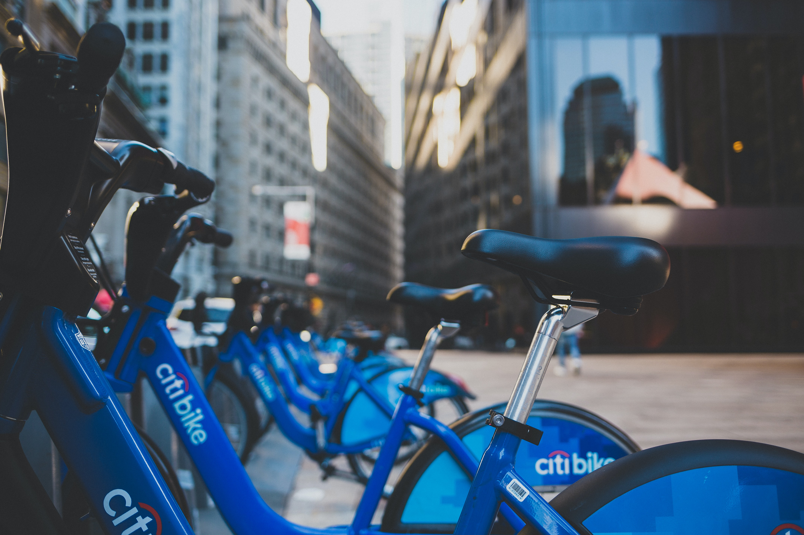
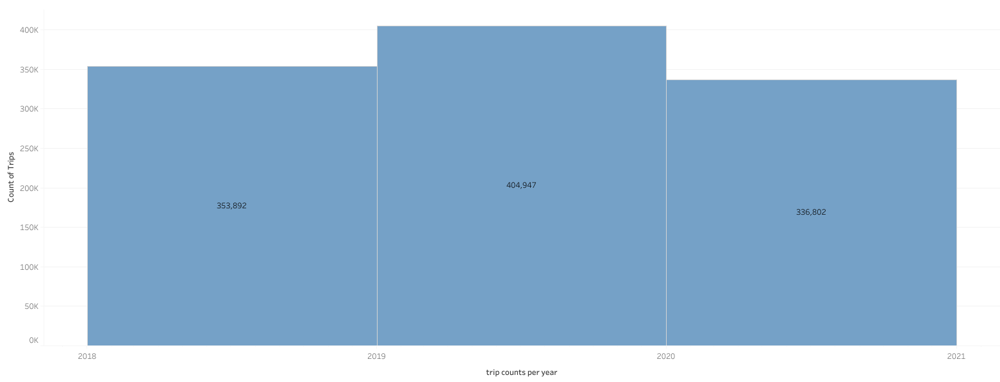
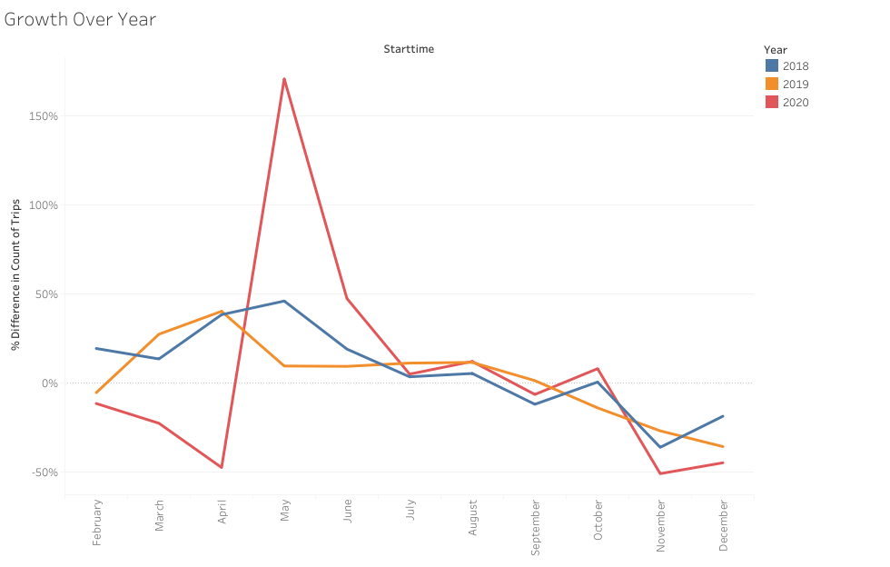
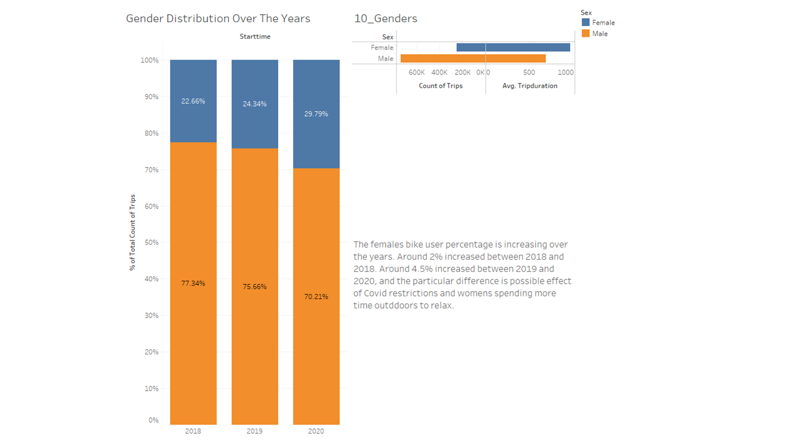
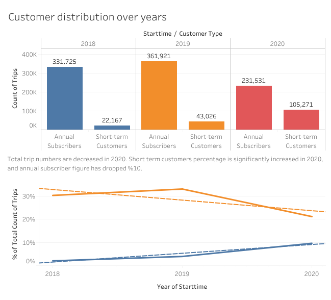
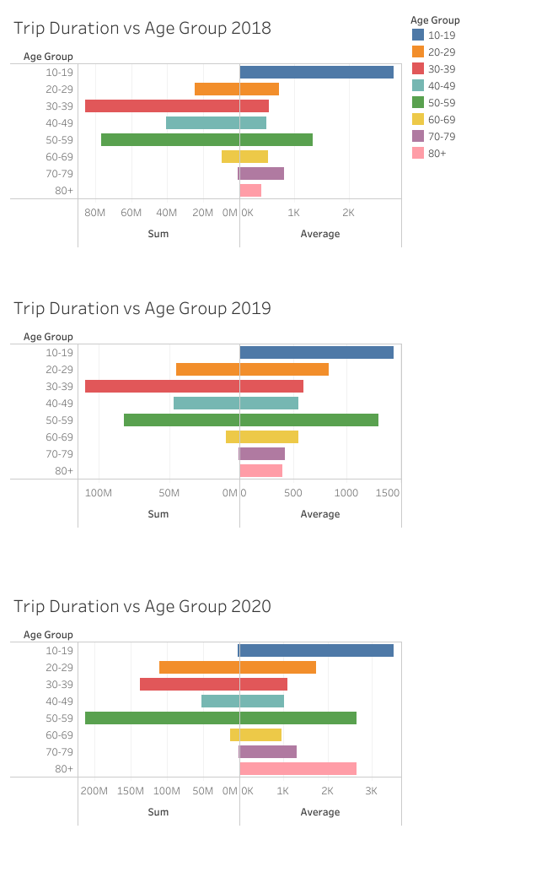

# 2018 - 2020 CitiBike Use Statistics 

This report is generated based on data provided in https://ride.citibikenyc.com/system-data for bike use statistics between 2018 and 2020.

## Citibike Use

+ In 2018, there are 353,892 trips recorded in CitiBike systems. 

+ In 2019 this number increased to 404,947. In 2019 there was a record number of 66.6 million of visitors to New York City, which helped the boost the number of bike use. 
  
+ In 2020, the citi bike use numbers decreased to 336,802. The main reason of this decrease is the Covid restrictions/lockdowns in May.

 

+ **In May 2020, you can see a significant jump in bike use. The murder of George Floyd leaded to a series of protests in the city, and the history of conflict between police and the cyclists increased the role of the bicycles.**
  

## Gender Distribution

 

The females bike user percentage is increasing over the years. Around 2% increased between 2018 and 2019. Around 4.5% increased between 2019 and 2020, and the particular difference is possible effect of Covid restrictions and womens spending more time outddoors to relax.

## Customer Type Distribution

 

The short term customer percentage particularly increased in 2020, and annual subscriptions dropped from %33 to %21. The main reason of this drop is the lockdowns, changing working conditions of people, and habits. 

## Trip Duration vs Age Groups

 

Bikers between 10 - 79 years old have similar patterns between 2018 and 2020. 

+ Bikers between 10-19 years old have the longest trips. 
+ Bikers between 20-29 years old have a positive trend.
+ Bikers between 30-39 years old affected the most in 2020, and have decreased use. 
+ Bikers between 80+ years old have significant positive trend. The average time of their use have been increased since 2018.